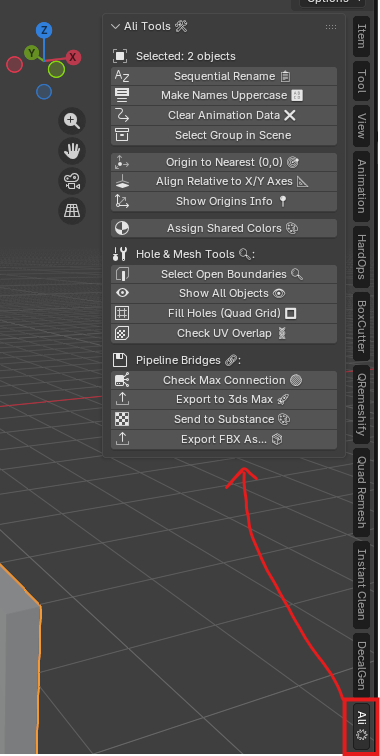
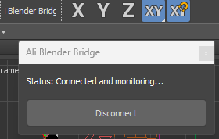

# Ali Pipeline Tools (v1.46)

Ali Pipeline Tools is a Blender add-on focused on fast production cleanup, smart naming, mesh validation, and reliable bridge export workflows for 3ds Max and Substance Painter.

## What Is New

- Added Select Group in Scene: opens a menu of base group names (example: wall)
- Added one-click isolation after group select: selects the chosen group and hides everything else
- Updated branding to Ali across UI labels and docs

## Interface Preview

### Blender Sidebar (N-Panel)

The panel appears in View3D Sidebar under the Ali tab.

  

### 3ds Max Bridge

The companion bridge macro appears in 3ds Max as Ali Blender Bridge.

  

## Features

### Naming and Management

- Sequential Rename: renames selected objects by nearest spatial order with automatic digit padding
- Make Names Uppercase: converts selected names to uppercase
- Clear Animation Data: removes animation data from selected objects

### Group Selection and Isolation

- Select Group in Scene:
  - Builds a dynamic menu from scene object base names
  - Shows one line per group name (example: wall)
  - When you click a group, all objects in that group are selected
  - All other scene objects are hidden automatically

### Origin and Alignment

- Origin to Nearest (0,0): snaps each selected mesh origin to nearest evaluated point
- Align Relative to X/Y Axes: shifts selected meshes relative to global X and Y alignment
- Show Origins Info: displays X/Y/Z origin values in millimeters with copy buttons

### Materials

- Assign Shared Colors: groups by base name and assigns distinct generated materials

### Mesh Inspection

- Select Open Boundaries: detects open-edge meshes and isolates them
- Show All Objects: unhides and selects all objects
- Fill Holes (Quad Grid): fills selected open loops in edit mode
- Check UV Overlap: identifies and isolates overlap issues on selected meshes

### Bridge and Export

- Check Max Connection: verifies active bridge file state
- Export to 3ds Max: exports selected objects to temp OBJ with normals
- Send to Substance: exports selected objects to Substance temp OBJ path
- Export FBX As: exports selected objects with pipeline-safe FBX settings

## Installation

1. Download ali_assiri_tools.py from this repository.
2. In Blender, open Edit > Preferences > Add-ons.
3. Click Install and choose ali_assiri_tools.py.
4. Enable the add-on from the add-ons list.
5. Open the Ali tab in the View3D Sidebar.

## Compatibility

- Blender: 3.0 and newer
- 3ds Max: versions that support macroscripts and custom toolbars
- OS: Windows (uses temp-directory bridge files)

## Notes

- Group matching is based on base-name parsing (numeric suffixes after dot or underscore are grouped together).
- Example: wall_01, wall_02, wall.001 are treated as one group.